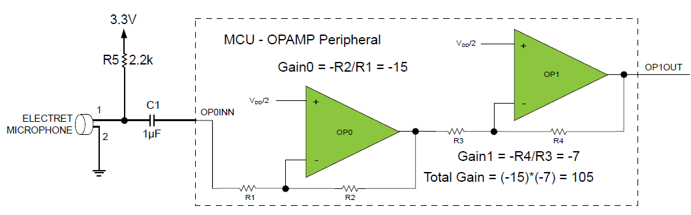

<!-- Please do not change this html logo with link -->

# AVR128DB48 Low-BOM Microphone Interface Using the Analog Signal Conditioning (OPAMP) Peripheral

  

A new feature introduced in the AVR® DB MCU is the Analog Signal Conditioning (OPAMP) peripheral. In this example, the OPAMP is used to amplify a weak signal up to the 100-millivolt range so that it can be detected by an analog comparator in the microcontroller (MCU) or converted to a digital signal by the MCU’s analog-to-digital converter (ADC). 
Three internal op amps are available for configuration in the AVR DB. The configuration for this example can be seen in the figure above. Including the MCU the setup uses an external electret microphone, a resistor, and a capacitor. For more information about setup and code, see the application note.

## Related Documentation

* Low-BOM Microphone Interface Using the Analog Signal Conditioning (OPAMP) Peripheral
* [AVR128DB48 Curiosity Nano User Guide](https://microchip.com/DSxxxxxxxxxx) <!-- TODO: Update link once assigned -->
* [AVR128DB48 device page](https://www.microchip.com/wwwproducts/en/AVR128DB48)

## Software Used

* [MPLAB® X](https://www.microchip.com/mplab/mplab-x-ide) v5.40 or later
* [MPLAB® XC8 Compiler](https://www.microchip.com/mplab/compilers) v2.20 or later
* MPLABX AVR-Dx_DFP version 1.4.75 or later
* For the Studio version of this project, please go to [this repository](https://github.com/microchip-pic-avr-examples/avr128db48-low-bom-mic-interface-using-opamp)
## Hardware Used

* [AVR128DB48 Curiosity Nano](https://www.microchip.com/DevelopmentTools/ProductDetails/PartNO/EV35L43A)
* Electret microphone
* One 2.2kΩ resistor
* One 1µF capacitor

## Setup

* Connect the hardware together as seen in the schematic of the application note

## Operation
* Connect the AVR128DB48 Curiosity Nano to a computer using a USB cable
* Download the zip file or clone the example to get the source code
* Open `avr128db48-low-bom-mic-interface-using-opamp.X` in MPLAB
* Press the make and program button to program the device.
* If no tool has been chosen, a window will open, select the AVR128DB48 Curiosity Nano. Tool can also be choosen in the project settings.   

## Conclusion
After going through this example, you should have a better understanding of how to set up the OPAMP peripheral to amplify weak signals from sensors into detectable signals for the MCU.  

